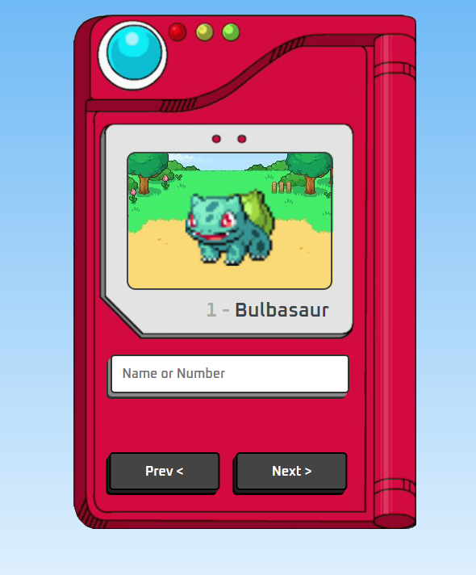

 # Pokedex
 
a project that was the realization of a dream, since I was little I loved pokemon and its technologies, now as a dev I've managed to develop a pokedex using js and an api, as well as html and css

## Tech Stack

**Client:** HTML, CSS, JavaScript, API

## Link

- [Deploy-Site](https://epokedex.netlify.app)

## Run Locally

Clone the project

```bash
  git clone https://link-to-project
```

Go to the project directory

```bash
  cd my-project
```

Open with live server


## ScreenShot


## Authors

- [@enzoshiotuqui](https://github.com/EnzoShiotuqui)
